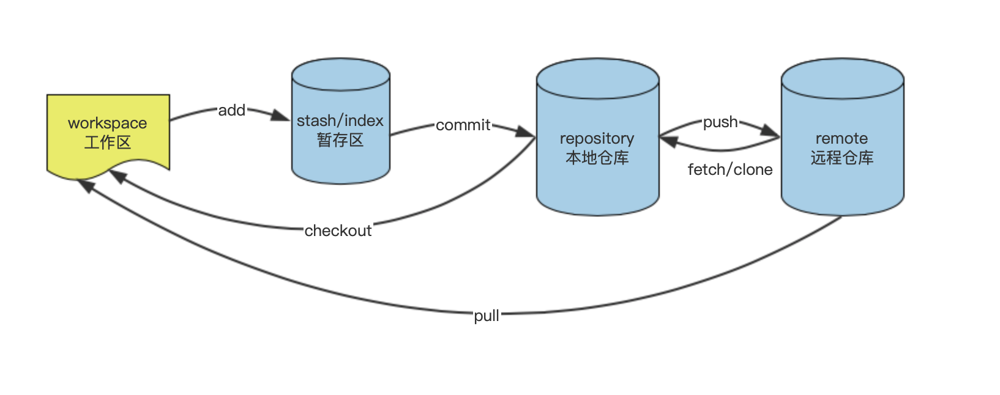

### 工作区、暂存区、本地仓库、远程仓库
- 定义
1. 工作区(workspace):即个人克隆项目到本地后,项目所在的文件夹目录.
2. 暂存区(stash/index):用于储存工作区中的变更(增删改等改动)的文件的地方.操作时使用git add会将本地所有的变更提交到暂存区中
3. 本地仓库(repository [rɪˈpɑːzətɔːri]):用于储存工作区和暂存区中提交上来的文件,使用git commit -m '提交内容的描述'
4. 远程仓库(remote):当进行到这里的时候即一个人的开发完毕的时,需要将自己开发的功能合并到著主项目中去,但因为是多人开发,要保管好主项目中存储的代码和文件的话,就需要放在搭建好的远程git仓库中,即远程仓库.具体操作:git push origin 远程分支名即可.

- 工作区、暂存区、本地仓库、远程仓库关系图


### 创建git项目
```
// 如果已有项目
cd 项目所在文件夹
git init

// 如果没有初始化项目无文件夹
git init 项目名称/文件夹名称
cd 文件夹名称

// 克隆git项目
git clone 路径
```

### git 命令

##### 分支 branch

命令|解释
:--|:--
git branch | 已经存在分支列表，当前分支前面加“*”号标记
git branch -a | 本地分支和远程分支
git branch -r  | 远程分支
git checkout -b hotfix-aboutus |  创建并切换新分支
git branch -m/-M oldbranch newbranch | 分支重命名
git branch -d/-D branchname | 删除分支
git branch -d -r branchname | 删除远程分支


##### 缓存 stash

命令|解释
:--|:--
git stash | 将代码缓存
git stash pop | 恢复缓存文件
git stash list | 缓存列表
git stash clear | 清除
git stash drop + stash名字 | 删除指定缓存
git stash show | 最新缓存跟本地代码差异
git stash show stash@{1} -p | 查看指定stash与本地目录差异详情

##### 重置 reset

命令|解释
:--|:--
git reset --mixed commitId | 将本地仓库(commit)文件撤回至工作区(workspace)。【默认】可不带--mixed
git reset --soft commitId | 将文件提交至本地仓库(commit)后撤回暂存区(add)
git reset --hard commitId | 将工作区、暂存区、本地仓库的所有提交的文件全都撤销（会删除）
HEAD | 当前版本
HEAD^/~1 | 上一版本
HEAD^^/~2 | 上两个版本

##### 恢复 reset
```
git relog
git reset id
```

##### 撤销 revert
命令|解释
:--|:--
git revert commitId | 将这个commit撤回，不影响后面的commit

vi语法：
  i ->  insert 插入,编辑模式
  ESC ->  退出编辑模式
  : ->  进入命令行模式
  w ->  保存
  q ->  退出
  :wq ->  保存并退出


##### 查看分支是从哪个分支创建的
```
git reflog --date=local | grep <branchname>

git reflog --date=local   // 查看本机git操作记录
git reflog show  --date=iso youhua  // 查看'youhua'分支所有git操作记录
```
[show]可写可不写