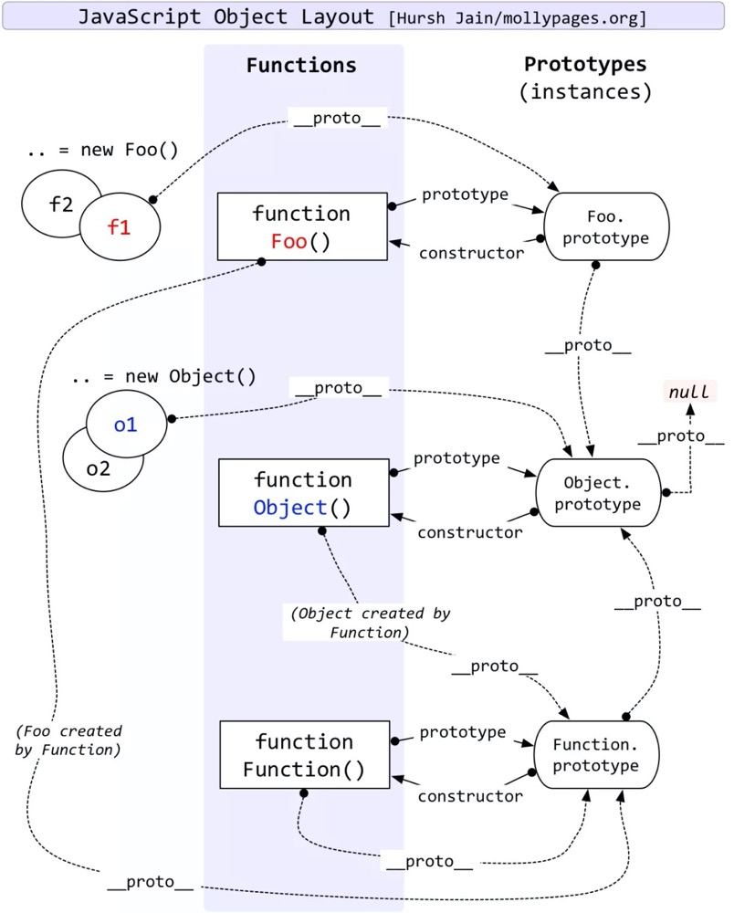
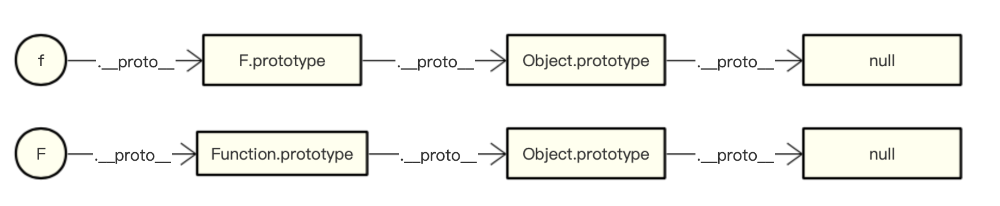

## 概念

- js分为**函数对象**跟**普通对象**，每个对象都有`__proto__`属性，但只有函数对象才能`prototype`属性。

- Object、Function都是js内置的函数，类似的还有我们常用到的Array、RegExp、Date、Boolean、Number、String。

- 属性__proto__是一个对象，它有两个属性，constructor和__proto__。

- 原型对象prototype有一个默认的constructor属性，用于记录实例是由哪个构造函数创建。





> 除了Object的原型对象（Object.prototype）的__proto__指向null，其他内置函数对象的原型对象（例如：Array.prototype）和自定义构造函数的
__proto__都指向Object.prototype, 因为原型对象本身是普通对象。
即：
```
Object.prototype.__proto__ = null;
Array.prototype.__proto__ = Object.prototype;
Foo.prototype.__proto__  = Object.prototype;
```

## 准则
1. Person.prototype.constructor == Person 
// **准则1：原型对象（即Person.prototype）的constructor指向构造函数本身**
2. person01.__proto__ == Person.prototype 
// **准则2：实例（即person01）的__proto__和原型对象指向同一个地方**

```
Foo.__proto__ = Function.prototype; // 准则2
Object.__proto__ = Function.prototype // 准则2 (Object本质也是函数)；
Function.__proto__ = Function.prototype // 准则2
```

```
Foo.__proto__ == Function.prototype
Foo.__proto__.__proto__ == Function.prototype.__proto__ == Object.prototype
```


## 测试题
* 测试题1
```
  function A(){}
  A.prototype.n = 1
  var b = new A()
  A.prototype = {
      n:2,
      m:3
  }
  var c = new A()
  console.log(b.n,b.m,c.n,c.m)    // 1 undefined 2 3
```
A.prototype = {}是重写原型，**重写后跟重写前就已经实例化的对象没有关系的**，所以n=2,m=3不生效。若要有效,添加以下代码`b.__proto__.m=4`

* 测试题2
```
  var F=function (){

  }
  Object.prototype.a = function(){
      console.log('a()')
  }
  Function.prototype.b = function(){
      console.log('b()')
  }
  var f= new F()
  f.a()//a()
  f.b()//无法执行b函数，报错
  F.a()//a()
  F.b()//b()
```


* 测试题3
```javascript {highlight=[9,12,15]}
function User(){}
User.prototype.sayHello = function(){}
const u1 = new User()
const u2 = new User()
console.log(u1.sayHello === u2.sayHello,1); // t
console.log(User.prototype.constructor,2);    //User
console.log(User.prototype === Function.prototype,3);    //f
console.log(User.__proto__ === Function.prototype,4);    //t
console.log(User.__proto__ === Function.__proto__,5);    //f-t
console.log(u1.__proto__ === u2.__proto__,6);        //t
console.log(u1.__proto__ === User.__proto__,7);        //f
console.log(Function.__proto__ === Object.__proto__,8);//f-t
console.log(Function.prototype.__proto__ === Object.prototype.__proto__,9);    //f
console.log(Function.prototype.__proto__===Object.prototype);    //t
console.log(u1.constructor == User )  //t
```
```
// 总结：
User.__proto__ == Function.prototype
Function.__proto__ == Function.prototype
Object.__proto__ == Function.prototype
// ---分隔---
15：u1.__proto__ == User.prototype
    User.prototype.__proto__ == Object.prototype
    User.prototype.constructor == User
```

* 测试题4
```
function A(){
}
function B(a){
　　this.a = a;
}
function C(a){
　　if(a){
this.a = a;
　　}
}
A.prototype.a = 1;
B.prototype.a = 1;
C.prototype.a = 1;
 
console.log(new A().a);
console.log(new B().a);
console.log(new C(2).a);
```
console.log(new A().a);　　//new A()为构造函数创建的对象，本身没有a属性，所以向它的原型去找，发现原型的a属性的属性值为1，故该输出值为1；

console.log(new B().a);　　//new B()为构造函数创建的对象，该构造函数有参数a，但该对象没有传参，故该输出值为undefined;

console.log(new C(2).a);　　//new C()为构造函数创建的对象，该构造函数有参数a，且传的实参为2，执行函数内部，发现if为真，执行this.a = 2,故属性a的值为2；

故这三个的输出值分别为：1、undefined、2

