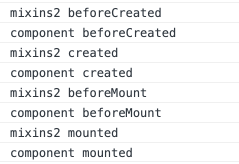
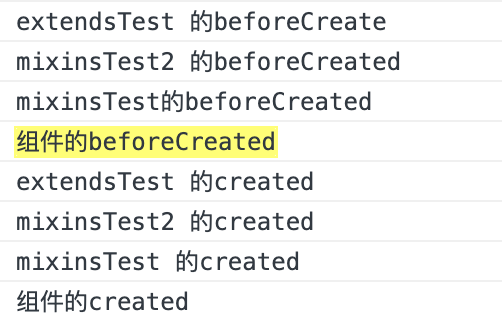

## Vue 中 mixin 和 mixins 的区别

> mixin 用于全局注册一个混入，如果有公共的组件使用频率很高的话，可以使用 mixin 很方便的引入公共的部分 mixins 选项接受一个混入对象的数组
> mixins 在引入组件之后，则是将组件内部的内容如 data 属性，methods 方法与父组件的内容相对应进行合并，可以对父组件的属性进行扩充，mixins 混入的钩子函数会优先于组件内的钩子函数执行，并且在遇到同名选项的时候也会有选择性的进行合并。

## vue 的 extends 和 mixins 的区别

> vue 的 extends 和 mixins 类似，通过暴露一个 extends 对象到组件中使用。

> extends 会比 mixins 先执行； [执行顺序](#item1)：extends > mixins[引用的先后顺序] > 组件

> extends 只能暴露一个 extends 对象，暴露多个 extends 不会执行

### Vue.mixin()示例：

**先定义 mixin.js**

```
const mixins = {
  data() {
    return {
      globalName: "这是全局名称",
      name: 'name'
    }
  }
  methods: {
    two(num){
        return num * num
    }
  }
}
export defaullt mixins
```

**在 main.js 文件全局引入**

```
import mixin from './mixin'
Vue.mixin(mixin)
```

**其他 vue 页面里面就可以使用 mixin 里面定义好的变量、方法，如：**

```
{{globalName}}  // 这是全局名称
{{name}}        // abc
data() {
  return {
    name: "abc",
    square: this.two(3) // 9
  }
}
```

### mixins

> 在组件的调用中，mixins 的数据是独立的、不想干扰的如：


```
<template>
  <div>
    <child></child>
    <child></child>
    <kid></kid>
  </div>
</template>
<script>
import Vue from "vue";
import mixins2 from "./mixins2";
// const mixins2 = {
//   data() {
//     return {
//       msg: 1,
//     };
//   },
//   methods: {
//     foo() {
//       this.msg++;
//     },
//   },
// };
// export default mixins2
Vue.component("child", {
  template: '<h1 @click="foo">child component- {{msg}}</h1>',
  mixins: [mixins2],
});
Vue.component("kid", {
  template: '<h1 @click="foo">kid component- {{msg}}</h1>',
  mixins: [mixins2],
});
export default {};
</script>
```

> data 组件中引用 代替 mixins 中引用

> methods 组件中调用 代替 mixins 中调用

> 生命周期调用顺序

## 实践 1：状态码统一过滤

一般情况下不要全局使用，因为会污染 vue 所有实例，这里通过一个简单的应用展示 mixin 的使用技巧，在所有 vue 实例中添加统一状态码过滤器。

因为自定义方法会在所有的实例中混入，如果按照以前的方法，难免会有覆盖原先的方法的危险，按照官方的建议，混入的自定义方法名增加前缀 \$\_ 用作区分。

创建一个 config.js 文件，用于保存状态码对应的含义，将其暴露出去

```
export const typeConfig = {
  1: "type one",
  2: "type two",
  3: "type three"
}
```

再创建一个 filters.js 文件，用于保存所有的自定义函数

```
import { typeConfig } from "./config"
export default {
  filters: {
    $_filterType: (value) => {
      return typeConfig[value] || "type undefined"
    }
  }
}
```

最后，在 main.js 中引入我们的 filters 方法集

```
import filter from "./filters"
Vue.mixin(filter)
```

接下来，我们就可以在 .vue 的模板文件中随意使用自定义函数了

```
<template>
  <div>{{typeStatus | $_filterType}}<div>
</template>
```

## 实践 2：大量表格页面中的分页功能

简单通用混入 list.js

```
const list = {
  data () {
    return {
      // 这些东西我们在list中处理，就不需要在每个页面再去手动的做这个了。
      loading: false, // 伴随loading状态
      pageNo: 1, // 页码
      pageSize: 15, // 页长
      totalCount: 0, // 总个数
      pageSizes: [15, 20, 25, 30], //页长数
      pageLayout: 'total, sizes, prev, pager, next, jumper', // 分页布局
      list: []
    }
  },
  methods: {
    // 分页回掉事件
    handleSizeChange(val) {
      this.pageSize = val
      // todo
    },
    handleCurrentChange (val) {
      this.pageNo = val
      // todo
    },
    /**
     * 表格数据请求成功的回调 处理完公共的部分（分页，loading取消）之后把控制权交给页面
     * @param {*} apiResult
     * @returns {*} promise
     */
    listSuccessCb (apiResult = {}) {
      return new Promise((reslove, reject) => {
        let tempList = [] // 临时list
        try {
          this.loading = false
          // todo
          // 直接抛出
          reslove(tempList)
        } catch (error) {
          reject(error)
        }
      })
    },
    /**
     * 处理异常情况
     * ==> 简单处理  仅仅是对表格处理为空以及取消loading
     */
    listExceptionCb (error) {
      this.loading = false
      console.error(error)
    }
  },
  created() {
    // 这个生命周期是在使用组件的生命周期之前
    this.$nextTick().then(() => {
      // todo
    })
  }
}
export default list
```

下面我们直接在组件中使用这个 mixins

```
import mixin from '@/mixins/list' // 引入
import {getList} from '@/api/demo'
export default {
  name: 'mixins-demo',
  mixins: [mixin], // 使用mixins
  data () {
    return {
    }
  },
  methods: {
    // 加载列表
    load () {
      const para = {
      }
      this.loading = true
      getList(para).then((result) => {
        this.listSuccessCb(result).then((list) => {
          this.list = list
        }).catch((err) => {
          console.log(err)
        })
      }).catch((err) => {
        this.listExceptionCb(err)
      })
    }
  },
  created() {
    this.load()
  }
}
```

## 实践 3：mixins 做公共数据的管理

有些时候我们有一些公共的数据它可能 3，4 个模块取使用但是又达不到全局的这种规模。这个时候我们就可以用 mixins 去管理他们，比如我们有几个模块要使用用户类型这个列表，我们来看使用 mixins 来实现共享。

```
// types.js
import {getTypes} from '@/api/demo' // ajax
export default {
  data () {
    return {
      types: [] // ==>  {name: '', value: ''}
    }
  },
  methods: {
    // 获取列表
    getAllTypesList () {
      getApiList().then((result) => {
        // todo
        this.types = result // 假设result就是我们需要使用的数据
      }).catch((err) => {
        console.error(err)
      })
    }
  },
  created() {
    // 在需要使用这个mixins的时候取自动请求数据  这个可要可不要  你想在父组件中执行也是ok的
    this.getAllTypesList()
  }
}
```

在组件中引用

```
import typeMixin from '@/mixins/types'
export default {
  name: 'template',
  mixins: [typeMixin],
  data () {
    return {
      // types这个数组在使用组件中不用多余的定义，直接拿来用就行
      type: ''
    }
  },
  methods: {
  }
}
```

至于 mixins 中得数据我们可以在组件中直接使用

```
<el-select v-model="type" clearable placeholder="请选择类型">
  <el-option v-for="item in types" :key="item.id" :label="item.templateName" :value="item.id"></el-option>
</el-select>
```

我们这样就可以不用 vuex 来去管理那些只有在模块间复用几次的数据，而且非常方便得去取我们想要得数据，连定义都省了。但是这有一个缺点。就是每次都会去重新请求这些数据。如果你不在乎这一点点瑕疵的话，我觉得用起来是完全 ok 得。

#### <font id="item1">extends、 mixins 、组件的执行顺序</font>

mixinsExtends.js

```
//暴露两个mixins对象
export const mixinsTest = {
  methods: {
    hello() {
      console.log("mixinsTest 的created");
    },
  },
  beforeCreate() {
    console.log("mixinsTest的beforeCreated");
  },
  created() {
    this.hello();
  },
};
export const mixinsTest2 = {
  methods: {
    hello2() {
      console.log("mixinsTest2 的created");
    },
  },
  beforeCreate() {
    console.log("mixinsTest2 的beforeCreated");
  },
  created() {
    this.hello2();
  },
};
//只能使用一个extends对象，多个无效，extends会先于mixins执行
export const extendsTest = {
  methods: {
    hello3() {
      console.log("extendsTest 的created");
    },
  },
  beforeCreate() {
    console.log("extendsTest 的beforeCreate");
  },
  created() {
    this.hello3();
  },
};
```

index.vue

```
<template>
  <div>home</div>
</template>
<script>
import { mixinsTest, mixinsTest2, extendsTest } from "./mixinsExtends";
export default {
  name: "Home",
  data() {
    return {};
  },
  beforeCreate() {
    console.log("组件的beforeCreated");
  },
  created() {
    console.log("组件的created");
  },
  mixins: [mixinsTest2, mixinsTest], // 先调用那个mixins对象，就先执行哪个
  extends: extendsTest, // 使用extends
};
</script>
<style lang="css" scoped></style>
```

> 运行结果
> 
